<div align="center">
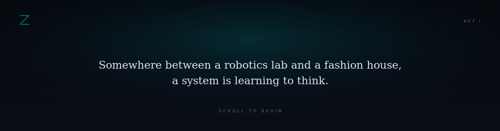
</div>

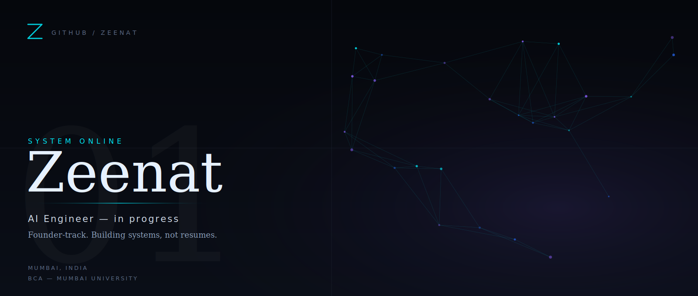

<div align="center">

<sub><a href="#mission">MISSION</a> &nbsp;/&nbsp; <a href="#arsenal">ARSENAL</a> &nbsp;/&nbsp; <a href="#deployments">DEPLOYMENTS</a> &nbsp;/&nbsp; <a href="#focus">FOCUS</a> &nbsp;/&nbsp; <a href="#analytics">ANALYTICS</a> &nbsp;/&nbsp; <a href="#roadmap">ROADMAP</a> &nbsp;/&nbsp; <a href="#transmission">TRANSMISSION</a></sub>

</div>

<br/><br/>

<a id="mission"></a>
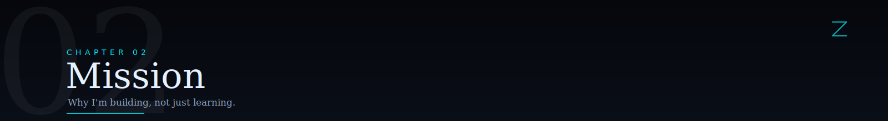

<br/>

<table>
<tr>
<td width="8%"></td>
<td width="54%" valign="top">

BCA student at Mumbai University (NEP), Google Student Ambassador, and an aspiring AI engineer — learning by building, not just studying.

Right now that means real-world projects in Python, steady reps on Data Structures & Algorithms, and hands-on time with full-stack development and open source. Always exploring, always improving.

<sub>AMBITION WITHOUT NOISE &nbsp;&#183;&nbsp; CURIOSITY WITHOUT LIMITS</sub>

</td>
<td width="4%"></td>
<td width="34%" valign="top">

<br/>

```
role       Aspiring AI Engineer
base       Mumbai, India
education  BCA (NEP), Mumbai University
title      Google Student Ambassador
mode       building > learning
```

</td>
</tr>
</table>

<br/><br/>

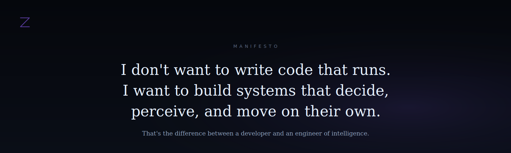

<br/><br/>

<a id="arsenal"></a>
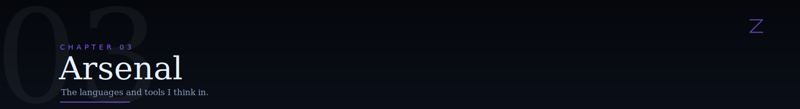

<br/>

<table>
<tr><td width="8%"></td><td width="20%"><sub>LANGUAGES</sub></td><td>Python &nbsp;&#183;&nbsp; Java &nbsp;&#183;&nbsp; JavaScript &nbsp;&#183;&nbsp; C++ &nbsp;&#183;&nbsp; SQL &nbsp;&#183;&nbsp; HTML &nbsp;&#183;&nbsp; CSS</td></tr>
<tr><td></td><td><sub>WEB / BACKEND</sub></td><td>Node.js &nbsp;&#183;&nbsp; Express.js &nbsp;&#183;&nbsp; React &nbsp;&#183;&nbsp; Next.js</td></tr>
<tr><td></td><td><sub>DATA</sub></td><td>MySQL &nbsp;&#183;&nbsp; MongoDB</td></tr>
<tr><td></td><td><sub>TOOLS</sub></td><td>Git &nbsp;&#183;&nbsp; GitHub &nbsp;&#183;&nbsp; VS Code &nbsp;&#183;&nbsp; PyCharm &nbsp;&#183;&nbsp; Figma</td></tr>
</table>

<br/>

<table>
<tr><td width="8%"></td><td width="20%"><sub>CURRENTLY LEARNING</sub></td><td>Machine Learning &nbsp;&#183;&nbsp; Generative AI &nbsp;&#183;&nbsp; Docker &nbsp;&#183;&nbsp; Cloud Computing &nbsp;&#183;&nbsp; System Design &nbsp;&#183;&nbsp; Backend Development</td></tr>
</table>

<br/><br/>

<a id="deployments"></a>
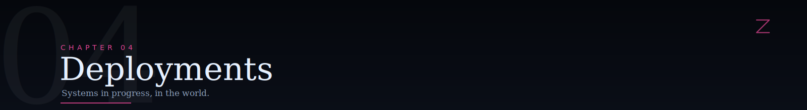

<br/>


<br/>

<table>
<tr>
<td width="50%">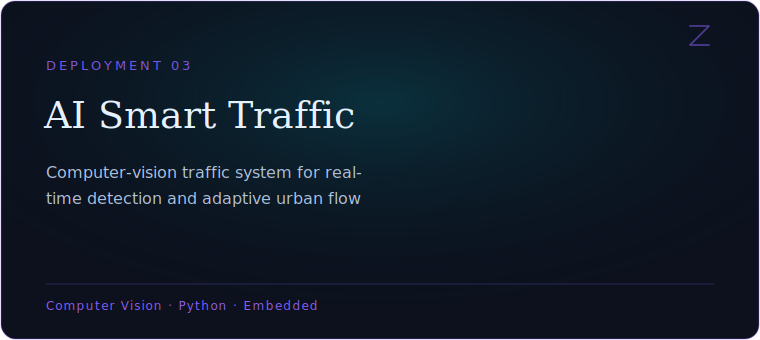</td>
<td width="50%"></td>
</tr>
<tr><td colspan="2" height="14"></td></tr>
<tr>
<td width="50%"></td>
<td width="50%"></td>
</tr>
</table>

<br/><br/>

<a id="focus"></a>


<br/>

<table>
<tr><td width="8%"></td><td width="20%"><sub>CURRENT FOCUS</sub></td><td>Artificial Intelligence &nbsp;&#183;&nbsp; Machine Learning &nbsp;&#183;&nbsp; Generative AI &nbsp;&#183;&nbsp; Python Development &nbsp;&#183;&nbsp; DSA &nbsp;&#183;&nbsp; Full-Stack Development &nbsp;&#183;&nbsp; Open Source</td></tr>
<tr><td></td><td><sub>INTERESTS</sub></td><td>AI &nbsp;&#183;&nbsp; Machine Learning &nbsp;&#183;&nbsp; Software Development &nbsp;&#183;&nbsp; Problem Solving &nbsp;&#183;&nbsp; Open Source &nbsp;&#183;&nbsp; Scalable Applications</td></tr>
</table>

<br/><br/>

<a id="analytics"></a>
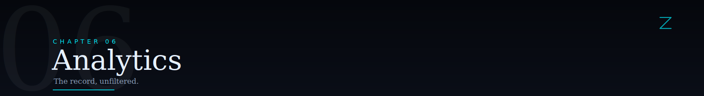

<br/>

<div align="center">


</div>

<br/><br/>

<a id="roadmap"></a>
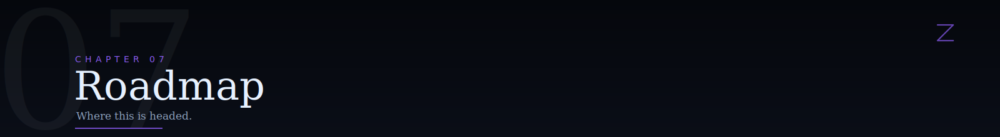

<br/>

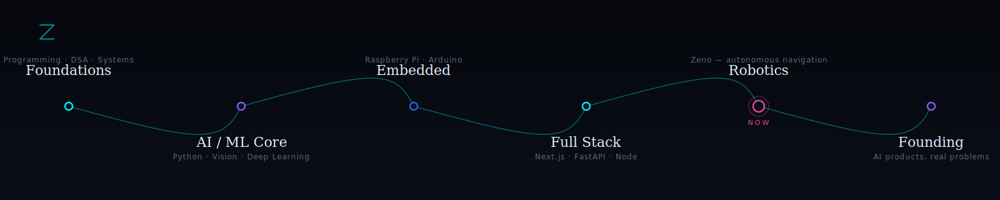

<br/>

<table>
<tr><td width="8%"></td><td>

**Goals**

- Become an AI Engineer
- Build AI products that solve real-world problems
- Contribute to open source
- Master full-stack development
- Strengthen problem-solving through LeetCode
- Build impactful AI-powered applications

</td></tr>
</table>

<br/><br/>

<a id="transmission"></a>
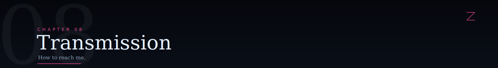

<br/>

<div align="center">

[LinkedIn](https://www.linkedin.com/in/zeenat-ansari-ab566b353) &nbsp;&#183;&nbsp; [Email](mailto:libraskingdom@gmail.com)

</div>

<br/><br/>

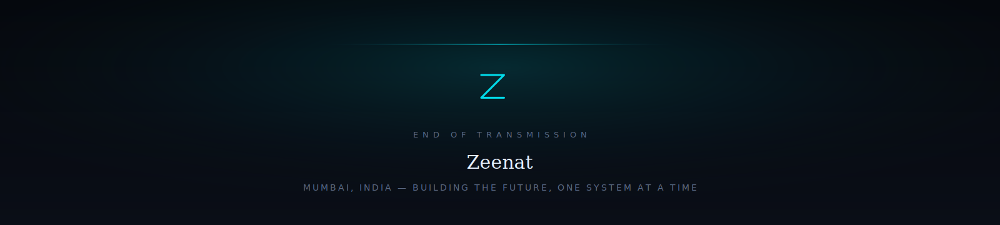
