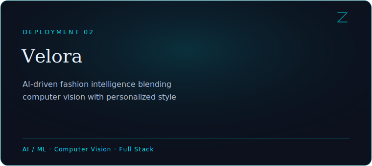
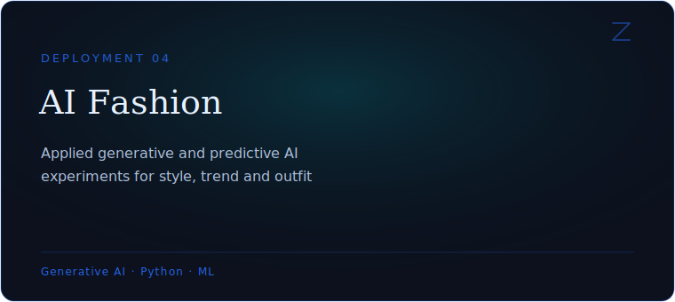
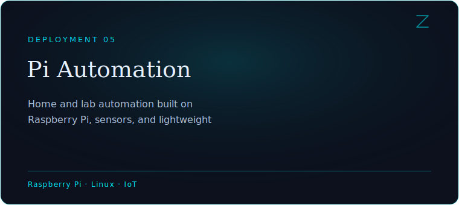
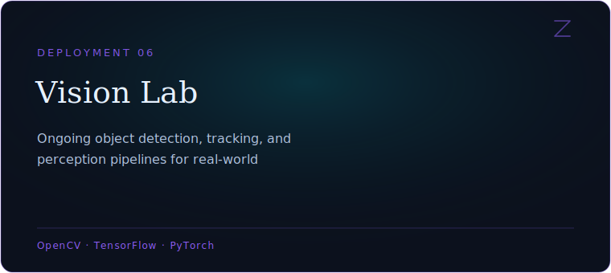

<div align="center">

</div>

<br/>

<div align="center">

<a href="#mission">Mission</a>&nbsp;&nbsp;·&nbsp;&nbsp;<a href="#arsenal">Arsenal</a>&nbsp;&nbsp;·&nbsp;&nbsp;<a href="#builds">Builds</a>&nbsp;&nbsp;·&nbsp;&nbsp;<a href="#research">Research</a>&nbsp;&nbsp;·&nbsp;&nbsp;<a href="#analytics">Analytics</a>&nbsp;&nbsp;·&nbsp;&nbsp;<a href="#roadmap">Roadmap</a>&nbsp;&nbsp;·&nbsp;&nbsp;<a href="#contact">Contact</a>

</div>

<br/>

<a id="mission"></a>


<br/>

<table>
<tr>
<td width="58%" valign="top">

### Mission

I'm not learning software to become a developer. I'm learning it to become an **AI engineer, entrepreneur, and founder** — someone who builds systems that solve problems most people haven't noticed yet.

Currently a BCA student at Mumbai University, but the work is already ahead of the syllabus: humanoid robotics, computer vision, embedded intelligence, and full-stack products built to ship, not to demo.

*Ambition without noise. Curiosity without limits.*

</td>
<td width="42%" valign="top">

**Currently**

```
role      → AI Engineer, in progress
base      → Mumbai, India
education → BCA, Mumbai University
mode      → building > learning
```

</td>
</tr>
</table>

<br/>

<a id="arsenal"></a>


<br/>

### Arsenal

<table>
<tr>
<td valign="top" width="20%"><b>Languages</b></td>
<td valign="top">Python · Java · JavaScript</td>
</tr>
<tr>
<td valign="top"><b>AI / ML</b></td>
<td valign="top">TensorFlow · PyTorch · OpenCV · LLMs · Generative AI</td>
</tr>
<tr>
<td valign="top"><b>Backend</b></td>
<td valign="top">FastAPI · Express · Node.js · Redis · Docker</td>
</tr>
<tr>
<td valign="top"><b>Frontend</b></td>
<td valign="top">Next.js · UI/UX Systems</td>
</tr>
<tr>
<td valign="top"><b>Hardware</b></td>
<td valign="top">Raspberry Pi · Arduino · Embedded Systems</td>
</tr>
<tr>
<td valign="top"><b>Infra</b></td>
<td valign="top">Linux · Git · GitHub · Cloud Computing · System Design</td>
</tr>
</table>

<br/>

<a id="builds"></a>


<br/>

### Active Deployments

<table>
<tr>
<td width="50%"></td>
<td width="50%"></td>
</tr>
<tr><td colspan="2" height="16"></td></tr>
<tr>
<td width="50%"></td>
<td width="50%"></td>
</tr>
<tr><td colspan="2" height="16"></td></tr>
<tr>
<td width="50%"></td>
<td width="50%"></td>
</tr>
</table>

<br/>

<a id="research"></a>


<br/>

### Research Threads

| Thread | Focus |
|---|---|
| Computer Vision | Detection & tracking pipelines for real-world constraints |
| Robotics Perception | Sensor fusion for humanoid navigation (Zeno) |
| Traffic Intelligence | Real-time adaptive control models |
| Generative & Applied ML | Recommendation and generation systems for fashion-tech |
| Embedded AI | Running lightweight models at the edge, on Raspberry Pi |

**Open source** — contributing to and maintaining tools across AI, robotics, and dev tooling. The best systems are built where others can learn from them.

<br/>

<a id="analytics"></a>


<br/>

### Analytics

<div align="center">


</div>

<br/>

<a id="roadmap"></a>


<br/>

### Learning Roadmap

```
Foundations        Programming · DSA · Systems
     │
AI / ML Core        Python · Vision · Deep Learning
     │
Embedded Systems     Raspberry Pi · Arduino
     │
Full Stack           Next.js · FastAPI · Node
     │
Robotics             Zeno — sensor fusion, autonomous navigation   ◀ now
     │
Founding             AI products that solve real problems           ↦ next
```

<br/>

### Current Objectives

- Ship Velora's recommendation engine — v1
- Get Zeno navigating autonomously with fused sensor input
- Deploy the Smart Traffic system on a live simulation
- Contribute to three open-source AI / robotics repositories

<br/>

<a id="contact"></a>


<br/>

<div align="center">

### Contact

[LinkedIn](https://linkedin.com/in/YOUR-HANDLE) &nbsp;·&nbsp; [X](https://x.com/YOUR-HANDLE) &nbsp;·&nbsp; [Email](mailto:YOUR-EMAIL@gmail.com) &nbsp;·&nbsp; [Portfolio](https://your-portfolio-link.com)

*Replace the placeholders above with real links before publishing.*

</div>

<br/>


